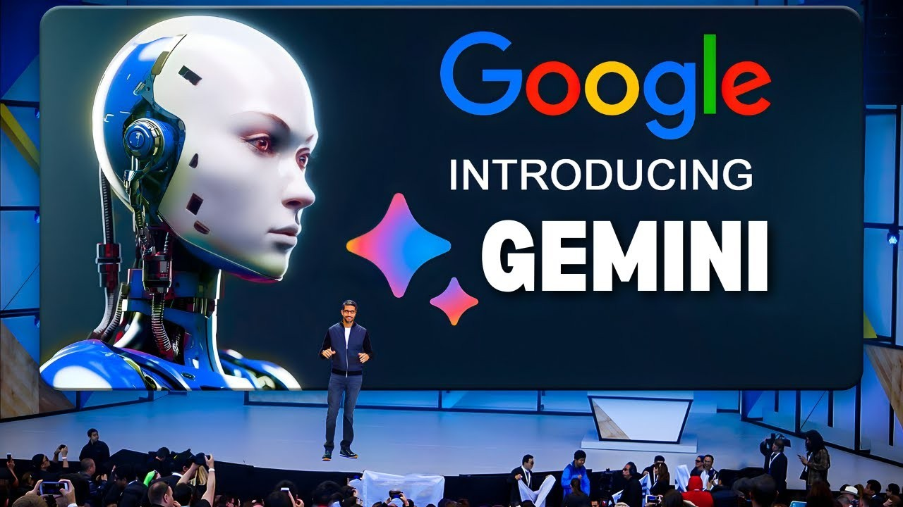
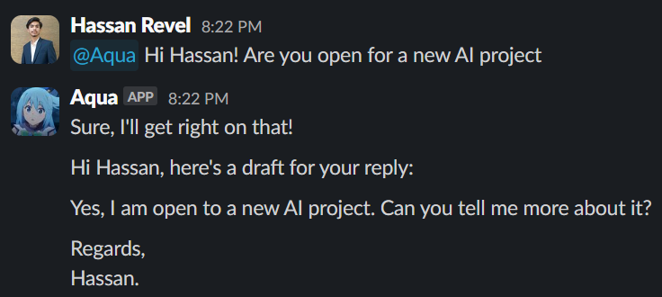
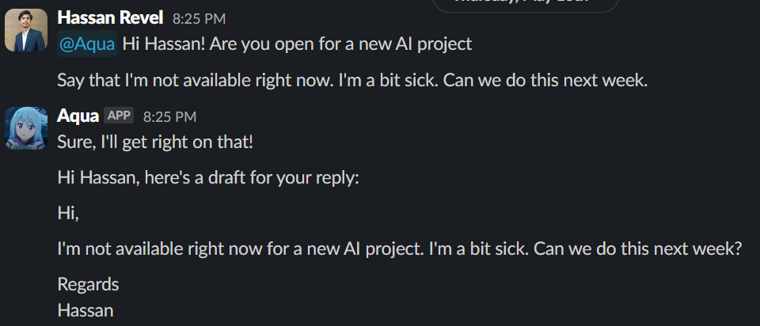

# Aqua Slack Bot

In today's fast-paced digital world, efficiency is key. That's why I’m excited to introduce Aqua, a Slack bot I developed using Flask and Google Gemini via the LangChain framework. Aqua's primary function is to draft emails, but this is just the beginning of its journey. In this blog post, I'll walk you through the creation of Aqua, its current capabilities, and my vision for its future.

## Building Aqua: The Foundation

Creating Aqua was a rewarding experience, combining the power of Flask for the web framework and Google Gemini, a cutting-edge large language model, through the LangChain framework. Here's a brief overview of the technologies involved:

- Flask: A lightweight WSGI web application framework in Python that makes it easy to build web applications.
- Google Gemini: A state-of-the-art language model that powers Aqua's ability to understand and generate human-like text.
- LangChain: A framework that enables seamless interaction with large language models, facilitating the integration of Gemini into Aqua.

The process involved setting up a Flask server to handle incoming requests from Slack, processing these requests with the help of Google Gemini, and then sending back the drafted email to the user within Slack.

## Aqua's Current Capabilities

At its core, Aqua’s job is straightforward: drafting emails. Users can interact with Aqua directly in Slack by providing a few key details, such as the recipient's name, the subject, and the main points they want to cover in the email. Aqua then processes this information and drafts a well-structured email, ready for the user to review and send.

This feature alone saves valuable time and ensures that emails are clear, concise, and professionally written. But Aqua's potential doesn’t stop here.

## The Future of Aqua: A Personal Assistant

While Aqua currently focuses on drafting emails, the vision for its future is much more ambitious. By connecting Aqua with additional tools and expanding its functionalities, it could evolve into a comprehensive personal assistant, a sort of LLM Operating System for your daily tasks.
Potential Future Features:

- Scheduling Meetings: Integrate with calendar tools to automatically schedule and manage meetings.
- Task Management: Assist with organizing tasks, setting reminders, and tracking progress.
- Information Retrieval: Provide quick answers to queries by pulling information from various data sources.
- Automated Reporting: Generate reports based on data inputs, useful for business and project management.

By leveraging the capabilities of large language models and integrating with various APIs and tools, Aqua can become an indispensable assistant, streamlining workflows and enhancing productivity.

## Conclusion

Aqua is a testament to the power and potential of combining advanced technologies to solve everyday problems. Starting with a simple email drafting task, Aqua showcases the immense possibilities that lie ahead for chatbots and personal assistants. As I continue to develop and expand Aqua’s functionalities, I am excited about the ways it will transform how we manage our tasks and interact with digital tools.

Stay tuned for more updates on Aqua's journey and how it will soon become an integral part of your digital life.